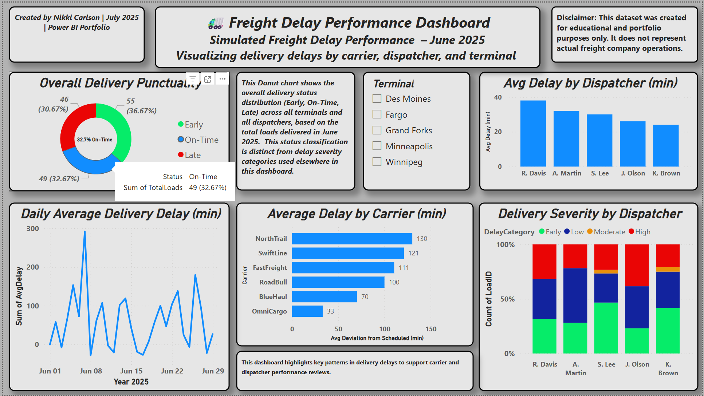

# Freight Delay Performance Dashboard (Power BI + SQL)

This project analyzes freight delivery delays using a manually constructed dataset...

## Overview

This dashboard focuses on:

- Identifying average delivery delays by carrier and dispatcher
- Tracking daily delay trends
- Summarizing delivery status performance
- Visualizing on-time delivery percentages
- Filtering insights by terminal location

## Disclaimer

The dataset was manually constructed for educational and portfolio purposes. It does not reflect actual performance data from any company.

## Anonymized Data Note

All carrier, dispatcher, and terminal names are fictional or anonymized. These identifiers were selected solely for demonstration and do not represent real organizations or individuals.

## Project Files

### Main Dataset & Summaries

- `freight_delay_data.csv` – Primary dataset used in slicers and model
- `carrier_delay_summary.csv` – Average delay by carrier
- `dispatcher_delay_summary.csv` – Dispatcher load and delay totals
- `daily_delay_trend.csv` – Daily average delay by terminal
- `on_time_delivery_breakdown.csv` – Delivery status counts & on-time percentages

### Power BI File

- `freight_delay_dashboard.pbix` – Available upon request  
  (Omitted from GitHub due to size/versioning limits. Contact via LinkedIn or GitHub for access.)

### SQL Scripts (`/SQL/`)

Executed in Google BigQuery Sandbox:

- `01_carrier_summary.sql`
- `02_dispatcher_summary.sql`
- `03_ontime_breakdown.sql`
- `04_delay_trend.sql`

### Visual & Modeling Assets

- `/Dashboard/` – Screenshots of the dashboard filtered by terminal
- `/Modeling/` – DAX formulas, Power Query transformations, and model views
- `/Screenshots/` – BigQuery editor views and other supporting screenshots
- `/Reports/` – Final project report in DOCX and PDF formats

## Power BI Visualizations

- Average Delay by Carrier (Bar Chart)
- Late Loads by Dispatcher (Column Chart)
- Daily Average Delay Trend (Line Chart)
- Delivery Status Breakdown (Donut Chart)
- On-Time Delivery Percentage (Card)
- Terminal Filter (Slicer)

## Tools Used

- Google BigQuery Sandbox – SQL-based data summarization
- Power BI Desktop – Dashboard development
- Power Query & DAX – Data modeling and transformation
- Manual CSV exports from SQL output
- GitHub – Version control and project documentation

## Lightweight Data Pipeline

This project reflects a basic SQL → CSV → BI pipeline:

1. **Transform (SQL)** – Queries summarize freight performance
2. **Load (CSV)** – Results exported manually
3. **Model (Power BI)** – CSVs used as source data for visuals

This setup demonstrates foundational ETL concepts that could be automated in future iterations.

## What You’ll Learn From This Repo

- How to move from raw freight data to actionable insights
- How to use SQL for logistics performance analysis
- How to build an interactive dashboard in Power BI Desktop
- How to document Power BI projects when publishing is restricted

## Next Steps

- Simulate monthly trend performance
- Add benchmarks for SLA comparisons
- Publish as a web-based dashboard when licensing permits

## Project Date

July 2025

## Created by

Nikkole Carlson
